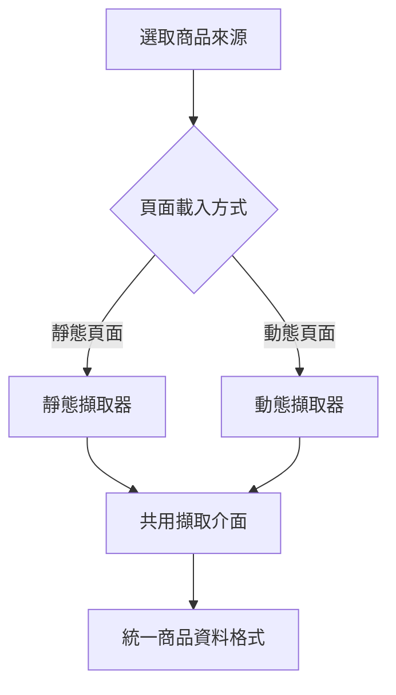

# 酒類商品資料擷取

處理結構不同的靜態與動態商品頁面，並將結果整理成相同商品欄位，供後續資料流程使用。

## 擷取流程

```mermaid
flowchart TB
    A[選取商品來源] --> B{頁面載入方式}
    B -->|靜態頁面| C[靜態擷取器]
    B -->|動態頁面| D[動態擷取器]
    C --> E[共用擷取介面]
    D --> E
    E --> F[統一商品資料格式]
```

## 設計考量

以共用擷取介面隔離來源差異，靜態與動態頁面各自處理取得資料的方式，輸出則遵循相同欄位格式。這讓來源處理與下游資料使用分開維護。
