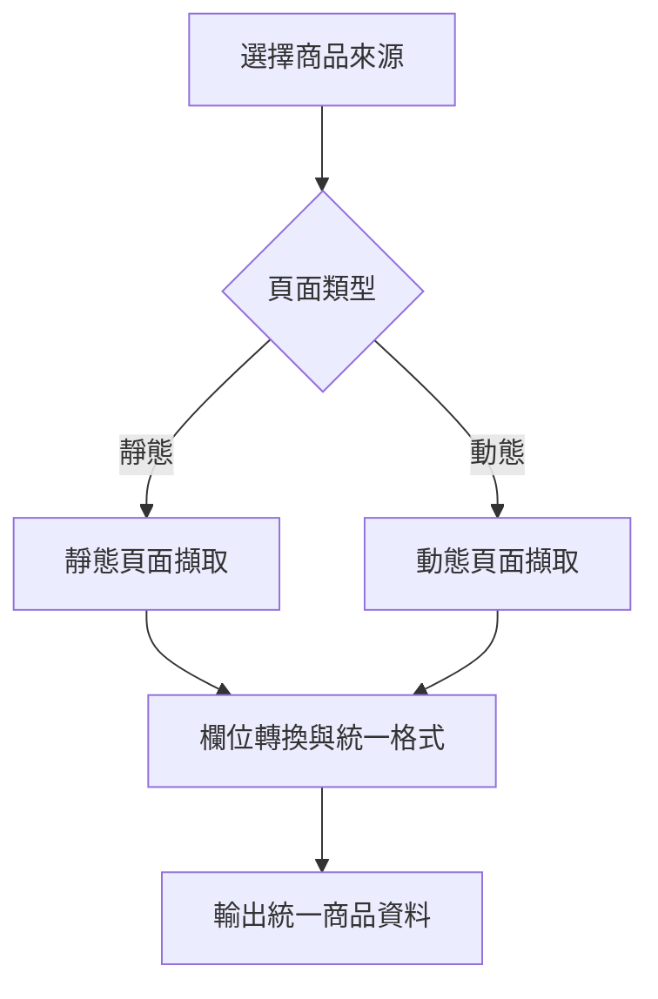

# 酒類商品資料擷取

規劃靜態與動態商品頁面的共通擷取方式，並統一商品欄位，方便新增來源及維護。

## 擷取流程

```mermaid
flowchart TB
    A[選擇商品來源] --> B{頁面類型}
    B -->|靜態| C[靜態頁面擷取]
    B -->|動態| D[動態頁面擷取]
    C --> E[欄位轉換與統一格式]
    D --> E
    E --> F[輸出統一商品資料]
```
