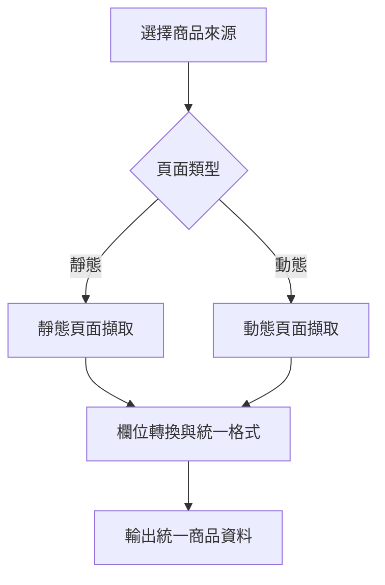

# 酒類商品資料擷取

針對不同酒類商品來源建立共通擷取方式，處理靜態與動態頁面，並整理成一致的商品欄位，方便後續新增來源及維護。

```mermaid
flowchart TB
    A[選擇商品來源] --> B{頁面類型}
    B -->|靜態| C[靜態頁面擷取]
    B -->|動態| D[動態頁面擷取]
    C --> E[欄位轉換與統一格式]
    D --> E
    E --> F[輸出統一商品資料]
```

以共用介面規劃各來源的擷取方式，讓新增來源時能遵循相同資料格式。
