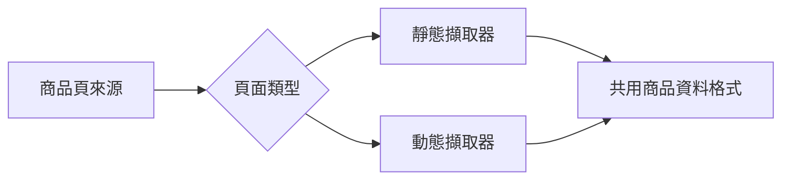

# 酒類商品資料擷取

不同來源有靜態與動態商品頁面，程式使用對應擷取器並整理成共用商品欄位。

```mermaid
flowchart LR
    Source[商品頁來源] --> Type{頁面類型}
    Type --> Static[靜態擷取器]
    Type --> Dynamic[動態擷取器]
    Static --> Schema[共用商品資料格式]
    Dynamic --> Schema
```

English: Static and dynamic product sources use separate scrapers and a shared output schema.
